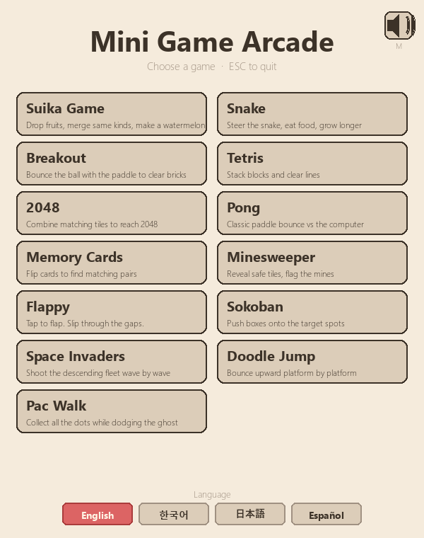

# Mini Game Arcade

A pygame-based mini game collection. 13 games launched from a single menu, with a 4-language UI (English / 한국어 / 日本語 / Español) and shared looping background music.


<p align="center">
  
</p>

## Games

| # | Name | Genre | Stages |
|---|---|---|---|
| 1 | Suika Game | Physics merge | ∞ |
| 2 | Snake | Arcade | ∞ |
| 3 | Breakout | Arcade | 10 patterns |
| 4 | Tetris | Puzzle | Level-based |
| 5 | 2048 | Puzzle | ∞ |
| 6 | Pong | Arcade vs AI | First to 5 |
| 7 | Memory Cards | Memory | 5 (3 → 12 pairs) |
| 8 | Minesweeper | Logic | 10×10 |
| 9 | Flappy | Reaction | ∞ |
| 10 | Sokoban | Puzzle | 20 levels |
| 11 | Space Invaders | Shooter | ∞ waves |
| 12 | Doodle Jump | Platformer | ∞ |
| 13 | Pac Walk | Maze | 4 mazes |

## Install

Requires Python 3.10+.

```bash
pip install pygame pymunk
```

`pymunk` is only used by Suika Game (2D rigid-body physics); the rest run on plain `pygame`.

## Run

```bash
python main.py
```

A 600×760 window opens with the launcher. Click any card to start a game.

## Controls

**Universal**

- `ESC` — back to menu (or quit from menu)
- `M` — toggle background music
- `R` — restart current game / level (where applicable)

**Per game**

- *Suika / Breakout / Pong / Memory / Minesweeper* — mouse
- *Snake / 2048 / Tetris / Pac Walk / Sokoban / Doodle Jump / Space Invaders* — arrow keys / WASD
- *Flappy* — space or click
- *Sokoban* — `N` next level, `P` previous level
- *Pac Walk / Memory* — `N` next stage after clear

## Languages

Switch from the four buttons at the bottom of the menu. Strings live in [games/i18n.py](games/i18n.py). Per-language system font stacks:

| Language | Font stack |
|---|---|
| English / Español | Segoe UI → Arial |
| 한국어 | Malgun Gothic → Gulim → Arial |
| 日本語 | Yu Gothic UI → Meiryo → MS Gothic → Arial |

## Project layout

```
.
├── main.py                  # Launcher menu + game dispatch
├── assets/
│   ├── star_music_box.mp3   # Background music (looped across menu and games)
│   └── screenshots/
│       └── menu.png
└── games/
    ├── __init__.py
    ├── i18n.py              # Translation strings + language-aware fonts
    ├── common.py            # Shared palette, screen size, helpers
    ├── audio.py             # BGM player + mute toggle
    ├── suika.py
    ├── snake.py
    ├── breakout.py
    ├── tetris.py
    ├── game2048.py
    ├── pong.py
    ├── memory.py
    ├── minesweeper.py
    ├── flappy.py
    ├── sokoban.py
    ├── invaders.py
    ├── doodle.py
    └── pacman.py
```

Each game module exposes a single `run(screen, clock)` function. It runs its own event loop and returns `"menu"` (ESC) or `"quit"` (window close); the launcher does the rest.

## Adding a new game

1. Create `games/your_game.py` with `def run(screen, clock): ...` that returns `"menu"` or `"quit"`.
2. Add name/description keys to `games/i18n.py` under all four languages.
3. Register it in the `GAMES` list in [main.py](main.py).

## License

Source code is MIT licensed — see [LICENSE](LICENSE).

The bundled audio file is third-party content with separate rights; see the Audio Asset Notice at the bottom of [LICENSE](LICENSE).
